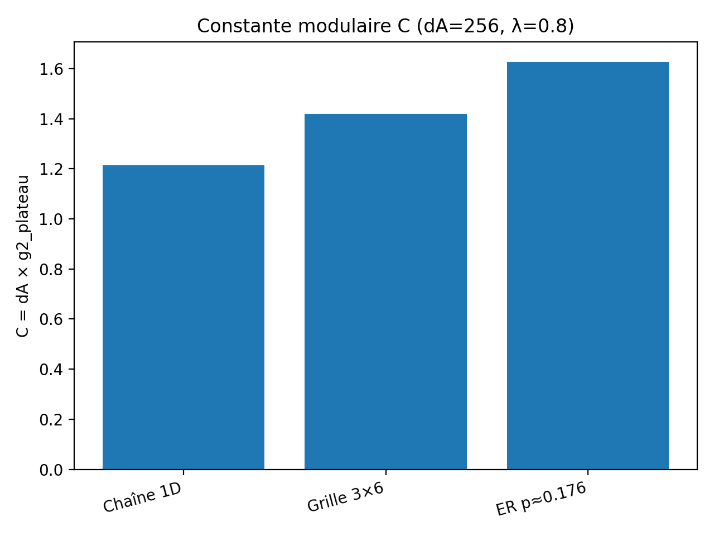
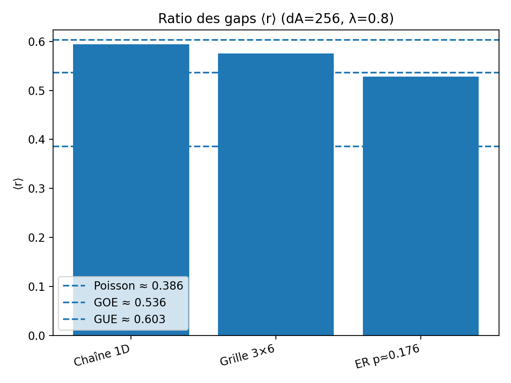
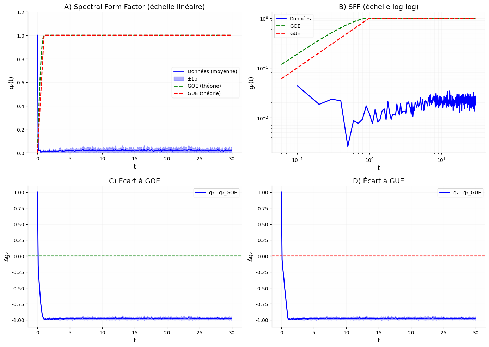

# bottom-up-quantum-gravity
**Émergence de l’espace, du temps et de la gravité à partir de l’intrication quantique**

Farid Hamdad — Février 2026

---

## Idée centrale

> L’espace, le temps et la gravité ne sont pas fondamentaux.  
> Ils émergent collectivement de la structure d’intrication d’un état quantique global fini.

---

## Pourquoi ce projet ?

La physique moderne décrit avec une précision remarquable :

- la **physique quantique** (théories des champs, information quantique),
- la **gravitation classique** (relativité générale, thermodynamique des trous noirs),

mais laisse ouverte une question fondamentale :

> **Pourquoi l’espace-temps existe-t-il,  
> et pourquoi la gravité possède-t-elle une structure géométrique et thermodynamique ?**

Ce projet explore une hypothèse minimale :

> **L’espace-temps n’est pas le théâtre de la physique.  
> Il est reconstruit à partir de l’intrication quantique.**

---

## 1. Fondement : Postulat minimal

Il existe un **état quantique global pur**

$$
|\Psi\rangle \in \mathcal{H} = \bigotimes_{i=1}^{N} \mathcal{H}_i
$$

défini sur $N$ degrés de liberté élémentaires (qubits),  
**sans espace, sans temps, sans métrique préalable**.

Tout le reste — temps, espace, dimension, géométrie, gravité effective —  
doit émerger exclusivement de la structure interne de l’intrication.

---

## 2. Méthodologie d’émergence

### 2.1 Émergence du temps : flot modulaire

Pour un sous-système $A$ :

$$
\rho_A = \mathrm{Tr}_{\bar{A}} |\Psi\rangle\langle\Psi|
$$
$$
K_A = -\log(\rho_A)
$$

Le **flot modulaire** :

$$
\mathcal{O}(\tau) = e^{i K_A \tau} \mathcal{O} e^{-i K_A \tau}
$$

définit une dynamique intrinsèque relationnelle (Page–Wootters).  
Le temps devient une propriété informationnelle interne.

### 2.2 Chaos modulaire (nouveau résultat)

Nous analysons le spectre de $K_A$.

**Ratio des gaps**

$$
\langle r \rangle = \left\langle \frac{\min(\Delta_n, \Delta_{n+1})}{\max(\Delta_n, \Delta_{n+1})} \right\rangle
$$

Références universelles :

- Poisson (intégrable) ≈ 0.386
- GOE ≈ 0.536
- GUE ≈ 0.603

**Résultat :**

$$
\langle r \rangle \in [0.53, 0.59]
$$

➡ Le flot modulaire devient chaotique (régime Random Matrix Theory).

### 2.3 Spectral Form Factor (SFF)

$$
g_2(t) = \frac{1}{d_A^2} \left| \sum_{n=1}^{d_A} e^{-it \tilde{\kappa}_n} \right|^2
$$

Structure observée :

- dip
- ramp
- plateau

**Résultat central :**

$$
g_2^{\mathrm{plateau}} \sim \frac{1}{d_A}
$$

Scaling universel.

### 2.4 Constante modulaire topologique

On définit :

$$
C = d_A \times g_2^{\mathrm{plateau}}
$$

Le scaling $1/d_A$ est universel.  
Mais le préfacteur $C$ **dépend de la topologie**.

**Résultats (dA = 256, λ = 0.8)**

| Topologie   | ⟨r⟩   | C     |
|-------------|-------|-------|
| Chaîne 1D   | 0.594 | 1.21  |
| Grille 3×6  | 0.575 | 1.42  |
| Graphe ER   | 0.528 | 1.63  |

**Figures**





**Interprétation**

Le flot modulaire devient universellement chaotique.  
Mais la géométrie d’intrication laisse une empreinte quantitative via $C$.

Autrement dit :

> La structure spatiale émergente influence le générateur temporel modulaire.

---

## 3. Émergence de l’espace

### Reconstruction géométrique

**Information mutuelle**

$$
I(i:j) = S(\rho_i) + S(\rho_j) - S(\rho_{ij})
$$

**Distance informationnelle**

$$
d_{ij} = -\log\left( \frac{I(i:j)}{I_{\max} + \epsilon} \right)
$$

MDS → points $x_i \in \mathbb{R}^d$

**Dimension effective** = dimension minimale stabilisant l’erreur.

---

## 4. Résultats principaux

### Dimension émergente

| Configuration  | Intrication   | Dimension |
|----------------|---------------|-----------|
| N=9, λ≈0       | Locale        | d≈2       |
| N=9, λ→1       | Non-locale    | d≈3       |
| N=16, λ≈0      | Locale        | d≈2       |
| N=16, λ→1      | Non-locale    | d≈3       |

### ER = EPR mesurable

Des qubits topologiquement distants deviennent géométriquement proches lorsque l’intrication non-locale augmente.

Signature **wormhole-like discrète** (statique).

### Gravité thermodynamique

Test de type Jacobson :

$$
\delta S \simeq \beta_{\mathrm{eff}} \, \delta E
$$

Relation stable pour N=9 et N=16.

---

## 5. Ce que le projet établit

✅ Une géométrie peut émerger d’un état quantique fini  
✅ La dimension dépend de l’intrication  
✅ ER=EPR est mesurable opérationnellement  
✅ Une thermodynamique de l’intrication apparaît  
✅ Le flot modulaire est chaotique (RMT)  
✅ Le plateau SFF suit $1/d_A$  
✅ La constante modulaire dépend de la topologie

---

## 6. Limites

❌ Limite continue $N \to \infty$ non démontrée  
❌ Pas de dynamique relativiste complète  
❌ Pas de dérivation des équations d’Einstein  
❌ Pas encore de prédiction expérimentale

## Organisation du dépôt
bottom-up-quantum-gravity/
├── paper/ # Manuscrit au format PDF/TeX
├── figures/ # Toutes les figures générées
│ ├── fig1_dimension_emergente_N9.png
│ ├── fig2_er_epr_N9.png
│ ├── fig3_jacobson_N9.png
│ ├── fig4_grid_N16.png
│ ├── fig5_mds_N16.png
│ ├── fig6_erepr_N16.png
│ ├── fig7_jacobson_N16.png
│ ├── topology_C.png
│ ├── topology_r.png
│ └── topology_SFF.png
├── code/ # Scripts Python/NumPy/SciPy
├── data/ # Données brutes et résultats
└── README.md


---

## Perspectives

- Finite-size scaling $N \to 25+$
- États aléatoires / critiques / topologiques
- Connexion avec SYK
- Étude multi-échelle (dimension spectrale)
- Implémentation sur simulateur quantique

---

## Citation

```bibtex
@misc{hamdad2026bottomup,
  author = {Hamdad, Farid},
  title = {Bottom-Up Quantum Gravity: Emergence of Space, Time and Gravity from Quantum Entanglement},
  year = {2026},
  howpublished = {GitHub repository},
  url = {https://github.com/Farid-Hamdad/Bottom-Up-Quantum-Gravity}
}
contact: hamdadfarid54@gmail.com


---

## Organisation du dépôt
